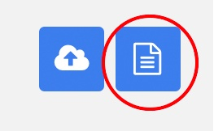
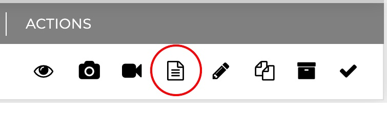
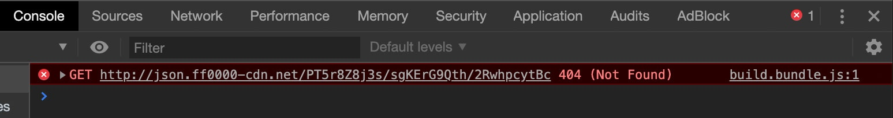
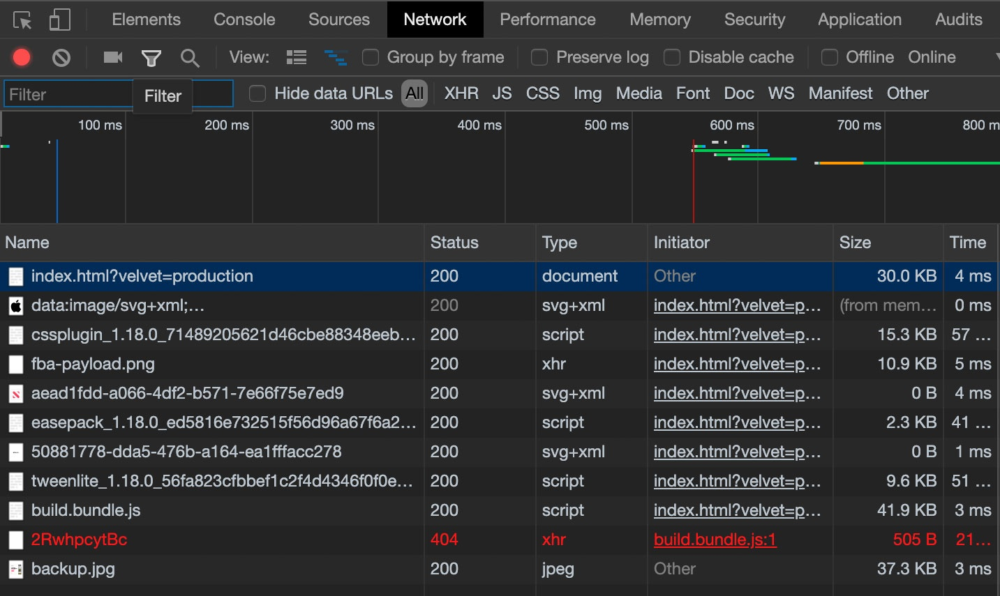
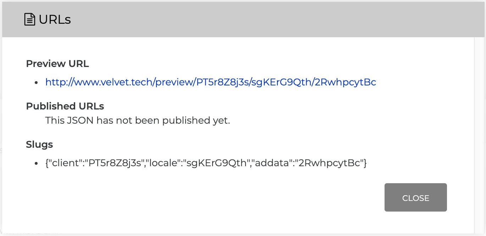
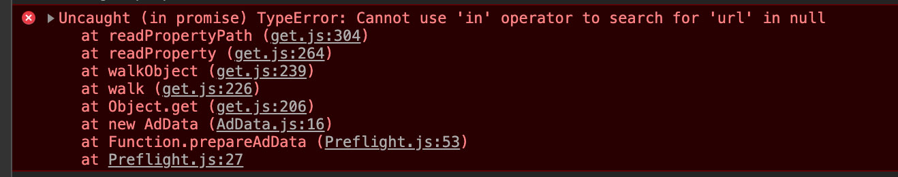
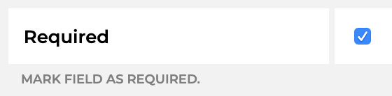

The goal of this page is to shine a light on the most common errors one may face while working with a Velvet project. They are all simple, but without experience, can be confusing.


Here are the common problems addressed on this page
1. Where are your slugs?
2. The trafficked ad fails to load
3. The ad starts erroring as you change Ad Data

# SOLUTIONS TO THESE PROBLEMS

<br>
<br>

# Where Are Your Slugs?

- There are two ways to open up the URLs panel which contains the information you want: client / locale / segment / addata
    1. Click the blue URLs icon at the upper right of the **Time Block** or **Ad Data** you are currently viewing
    <br>
    
    2. Inline under the Actions column. As part of the item within a list of items is a URLs icon. These exist in either the **Segments** or **Ad Data** tab of your **Locale**
    <br>
    

Note the **Ad Data** URL panel will not show you Segment slugs, because **Ad Data** overrides **Segment**.<br>
Similarly, the **Segment** URL panel will not give you **Ad Data** slugs, because a **Segment** can contain multitudes of **Ad Data**

<br>
<br>

# The Trafficked Ad Fails to Load

### What you may notice

<dl>
<dd></dd>
<br>
<dd></dd>
</dl>

### The explanation & solution
Notice that the URL which fails to load - http://json.ff0000-cdn.net/PT5r8Z8j3s/sgKErG9Qth/2RwhpcytBc - is not shown in the AdData's URL panel

<dl>
<dd></dd>
</dl>

Also notice how Published URLs is empty? The Ad Data (and therefor Locale) have not been published yet. They need to be approved and published before trafficking.

<br>
<br>

# The Ad Starts Erroring as You Change Ad Data

You may see an error not entirely dissimilar to this...
<br>
<dl>
<dd></dd>
</dl>

This is likely because the Velvet Ad Data Key you're looking at is empty - maybe you didn't enter text, or upload an image, or fill out the field in a way to return non-null information upon request


### *Fixing on the development side...*

- Add exceptions and only do something in your build files if that information exists

This...
```
new UIImage({
    target: T,
    source: adData.imageFromVelvet,
    align: Align.CENTER
})
```
becomes...
```
if (adData.imageFromVelvet){
    new UIImage({
        target: T,
        source: adData.imageFromVelvet,
        align: Align.CENTER
    })
}
```

### *Fixing on the Velvet side...*

- Within your **Template**, make the field appearing as `null` or otherwise `empty` a *required* field and ensure your build will never receive an unaccounted for `null` value again
<br>
<dl>
<dd></dd>
</dl>