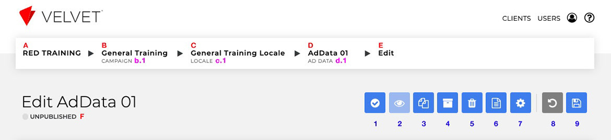
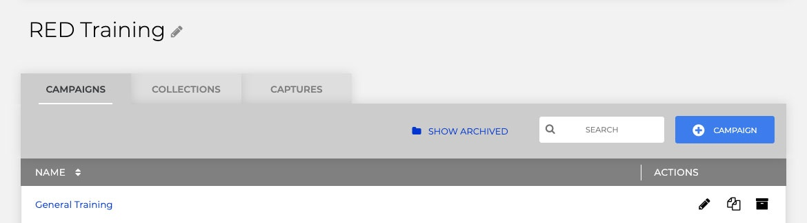
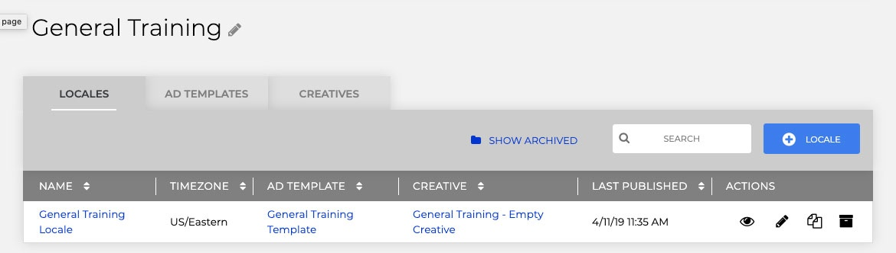
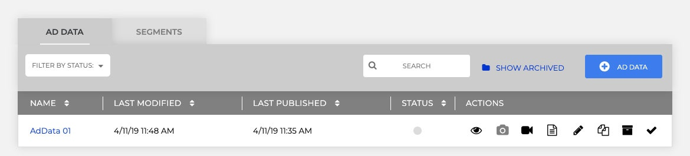
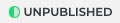
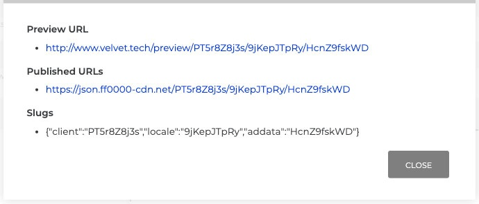
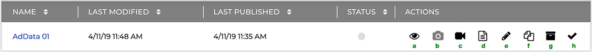

This is a general overview for what the Navigation and most common principle UI of Velvet is. The example shown in the Fig 1 is all the way down into the Ad Data level.

# **Fig 1.**
## 
Whether looking at Ad Data or Segments or Locales or Time Blocks, the basic logic remains consistent: **A** = **b.1**, **B** = **c.1**, **C**= **d.1**, etc

**Fig 1.A.** (*Client name*) or **Fig 1.b.1** - Return to the root **Campaigns** menu containing all available **Campaigns** for the client

 

**Fig 1.B.** (*Campaign name*) or **Fig 1.c.1** - Return to the root level of the **Campaign**, which has that **Campaign**'s **Locale**, **Template**, and **Creative** information

 

**Fig 1.C.** (*Locale name*) or **Fig 1.d.1** - Return to the root level of that **Locale**, which has that **Campaign**'s **Ad Data** and **Segments**

 

**Fig 1.D.** (*Current Content name*) Navigate to the content you're currently looking at

**Fig 1.E.** No function - describes the process you're currently undertaking (editing an **Ad Data** in this case)

**Fig 1.F.** The state of your **Ad Data**. Can be *UNPUBLISHED*, *APPROVED*, or *PUBLISHED*

     - Approved 
     - Published

 

**Fig 1.1.** Approve content (must be approved before being published)

 Publishing occurs at the Locale level ( <strong>C</strong>. or <strong>d.1</strong>), although the button may exist at the <strong>Segment</strong> or <strong>Time Bloc</strong>k level - they all do the same thing: publish the <strong>Locale</strong>

 

**Fig 1.2.** Preview Content

 the eye will appear active when creative (HTML) has been uploaded

 

**Fig 1.3.** Clone - make a duplicate of the content (**Locale** / **Template** / **Ad Data**) that will be independent from its original version

**Fig 1.4.** Archive the current location

**Fig 1.5.** Delete the current location

**Fig 1.6.** URLs - the slug, preview paths, and live paths used by the current item (<strong>Segment</strong> or <strong>Ad Data</strong>)

**Fig 1.7.** Edit Template - go to the template assigned to this Ad Data's locale and adjust as needed

**Fig 1.8.** Reset the current content

**Fig 1.9.** Save the current content (**Ad Data** / **Segment** / **Time Block** / **Creative** / **Campaign** / **Template**)

Many of these functions from <strong>Fig 1.1</strong> - <strong>Fig 1.9</strong> are also also available inline for each item listed per **Locale**, **Segment**, or **Ad Data**.
Sometimes icons such, as <strong>Fig 1.6</strong>'s URLs icon, for a page and not part of the list.
This happens when the list item - such as a **Time Block** - doesn't have unique URL information

 
 

# **Fig 2.**
## 

**Fig 2.a.** Preview the Ad Data

As with <strong>Fig 1.2</strong> the icon will appear active only when a creative (HTML) has been uploaded

 

**Fig 2.b.** Generate Statics

 the camera will appear active as long as the uploaded creative has the feature selected 

 

**Fig 2.c.** Generate Videos

Like statics, the icon's activity is dependant on if the creative has the feature selected 

 

**Fig 2.d.** URLs - the slug, preview paths, and live paths used by the current item (Segment or Ad Data)

**Fig 2.e.** Edit the item

**Fig 2.f.** Clone - make a duplicate of the content (Locale, Template, Ad Data) that will be independent from its original version

**Fig 2.g.** Archive the item

**Fig 2.h.** Approve content (must be approved before being published)

 Publishing occurs at the <strong>Locale</strong> level (<strong> Fig 1.C.</strong> or <strong>Fig 1.d.1</strong>)
