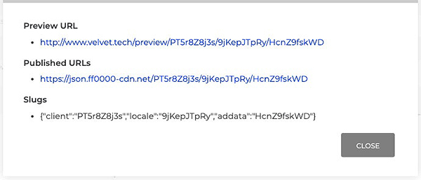

This is a general overview for what the Navigation and most common principle UI of Velvet is. The example shown in the Fig 1 is all the way down into the Ad Data level.

# Fig 1.
## 
Whether looking at Ad Data or Segments or Locales or Time Blocks, the basic logic remains consistent: A= b.1, B= c.1, C= d.1, etc

<dl>
<dt>Fig 1.A. (<i>Client name</i>) or Fig 1.b.1- Return to the root Clients menu containing all available Campaigns for the Client</dt>

<dd></dd>
 

<dt>Fig 1.B.(<i>Campaign name</i>) or Fig 1.c.1- Return to the root level of the Campaign, which has that Campaign's Locale, Template, and Creativeinformation</dt>

<dd></dd>
 

<dt>Fig 1.C.(<i>Locale name</i>) or Fig 1.d.1- Return to the root level of that Locale, which has that Locale's Ad Dataand Segments</dt>

<dd></dd>
 

Fig 1.D.(<i>Current Content name</i>) Navigate to the content you're currently looking at
</dl>

Fig 1.E.No function - describes the process you're currently undertaking (editing an Ad Datain this case)

Fig 1.F.The state of your Ad Data. Can be <i>UNPUBLISHED<i>, <i>APPROVED<i>, or <i>PUBLISHED<i>

 - Approved 
 - Published

Fig 1.1.Approve content (must be approved before being published)

 Publishing occurs at the Locale level ( C. or d.1), although the button may exist at the Segment or Time Block level - they all do the same thing: publish the Locale
 

Fig 1.2.Preview Content

 the eye will appear active when creative (HTML) has been uploaded
 

Fig 1.3.Clone - make a duplicate of the content (Locale/ Template/ Ad Data) that will be independent from its original version

Fig 1.4.Archive the current location

Fig 1.5.Delete the current location

Fig 1.6.URLs - the slug, preview paths, and live paths used by the current item (Segment or Ad Data)

Fig 1.7.Edit Template - go to the template assigned to this Ad Data's locale and adjust as needed

Fig 1.8.Reset the current content

Fig 1.9.Save the current content (Ad Data/ Segment/ Time Block/ Creative/ Campaign/ Template)

Many of these functions from Fig 1.1 - Fig 1.9 are also also available inline for each item listed per Locale, Segment, or Ad Data.
Sometimes icons such, as Fig 1.6's URLs icon, for a page and not part of the list.
This happens when the list item - such as a Time Block- doesn't have unique URL information

 
 

# Fig 2.
## 

Fig 2.a.Preview the Ad Data

As with Fig 1.2 the icon will appear active only when a creative (HTML) has been uploaded
 

Fig 2.b.Generate Statics

 the camera will appear active as long as the uploaded creative has the feature selected 
 

Fig 2.c.Generate Videos

Like statics, the icon's activity is dependant on if the creative has the feature selected 
 

Fig 2.d.URLs - the slug, preview paths, and live paths used by the current item (Segment or Ad Data)

Fig 2.e.Edit the item

Fig 2.f.Clone - make a duplicate of the content (Locale, Template, Ad Data) that will be independent from its original version

Fig 2.g.Archive the item

Fig 2.h.Approve content (must be approved before being published)

 Publishing occurs at the Locale level ( Fig 1.C. or Fig 1.d.1)